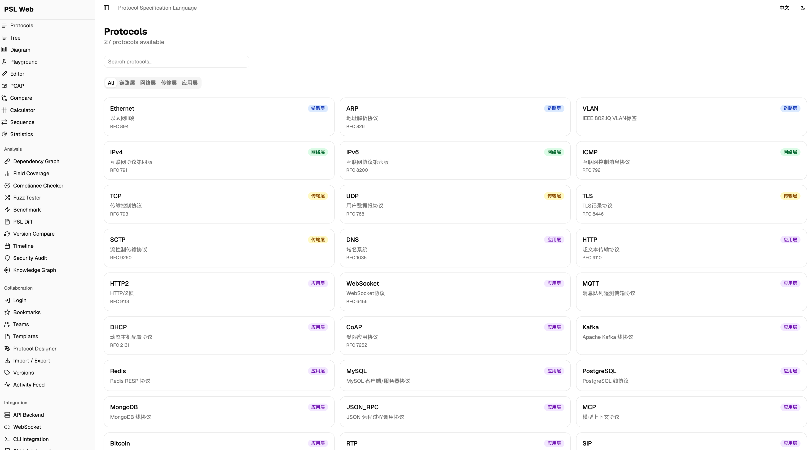

<p align="center">
  
</p>

<h1 align="center">PSL — Protocol Specification Language</h1>

<p align="center">
  Define any binary protocol in text, encode and decode automatically.
</p>

<p align="center">
  <a href="README.md">English</a> | <a href="README_ZH.md">中文</a>
</p>

---

PSL is a universal binary protocol codec engine for Go. You describe a protocol's structure in a `.psl` text file — field names, bit widths, byte order, checksums, conditional fields — and the engine handles encoding and decoding automatically. No per-protocol code needed.

Built-in protocols: IPv4, TCP, UDP, ICMP, ARP, DNS, HTTP/1.1, WebSocket. You can define your own the same way.

```bash
go build -o psl .
```

## Web UI

[PSL UI](https://github.com/hsqbyte/psl_ui) provides a web-based interface for browsing, visualizing, and interacting with PSL protocol definitions.

<p align="center">
  
</p>

## License

[GPL-3.0](LICENSE)
